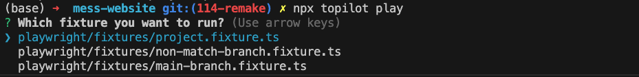

# topilot
Topilot CLI tools

[Topilot](https://topilot.dev/) is a platform for E2E testing at large scale.

## Table of Contents
<!-- toc -->
- [Installation](#installation)
- [Get Started](#get-started)
- [Features](#features)
- [Usage](#usage)
- [License](#license)
<!-- tocstop -->

## Installation

To install the package, run the following command:

```
npm install --save-dev topilot
```

## Get Started

To use Topilot, follow these steps:

- Register on [topilot.dev](https://topilot.dev/).
- Create a project.
- Copy the token from the project settings.
- Set the `TOPILOT_TOKEN` environment variable with the copied value. Do this in both:
    - A local project folder with a `.env` file.
    - The CI environment.

## Features

- automate and reuse fixture by play playwright fixtures
- focus on waht really matters by select key test cases to run in CI/CD pipeline

## Usage

## Use `topilot play` to run Playwright fixtures

Fixtures are a core concept in Playwright that provide an encapsulated, reusable, lazy-loaded, and composable way of establishing an environment.

However, fixtures are not runnable on their own, so it can be inconvenient to focus on writing and testing them.

To solve this problem, you can define your fixture in an ES module with `setup`, `teardown`, and `name` exported. Topilot will:

- extend playwright `test` object with the fixture, which combines the `setup` and `teardown` function
- generate tests for the fixture `setup` and `teardown`

Details:

1. Create fixtures as ES modules with the extension `.fixture.ts`.
    
    To create a fixture, create an ES module that exports the following named members:
    
    - `name`: the fixture name used in destructuring params of tests.
    - `setup`: a function to set up the fixture values.
    - `teardown`: a function to tear down the fixture values.
    
    For example:
    
    ```
    // project.fixture.ts
    export const name = "project";
    
    export const setup = async ({ page }) => {
      // create project here
      // ...
      const project = {
        // project info used by other tests
      };
      return { project };
    };
    
    export const teardown = async ({ page, project }) => {
      // teardown for the project
      // ...
      return {project: null};
    };
    
    ```
    
    Both setup and teardown should return the new fixture value, which will be uploaded to Topilot so that this fixture is used in other Playwright tests or manual tests.
    
2. Run `topilot play` in a terminal, then choose which fixture to play.
    
    
    
3. Replace Playwright `test` with `topilot`.
    
    ```
    import topilot from 'topilot'
    
    topilot('should add an item', async ({ todoPage }) => {
      await todoPage.addToDo('my item');
      // ...
    });
    
    ```
    
    `topilot` is the Playwright test object with fixtures extended, so you can use any fixtures defined in `.fixture.ts` files.
    

## Select Key Test Cases to Run in CI/CD Pipeline

Here are the steps to follow:

1. Use `topilot push` to upload tests within the current branch to Topilot.
2. Select the key cases in Topilot.

When your Playwright tests are triggered in a CI/CD environment, only the selected key cases will be run. Other cases will be skipped to save time and focus on what really changed and matters.

## Typescript

To get typescript not yelling at you with the unknown fixture error, we should extend topilot with module merging.

```tsx
// my-fixture.fixture.ts
declare module "topilot" {
  interface Fixtures {
    "myFixture": string
  }
}

export const setup = () => {}

export const teardown = () => {}

export const name = "myFixture"
```

## License

This package is licensed under the MIT license. See LICENSE for more information.
